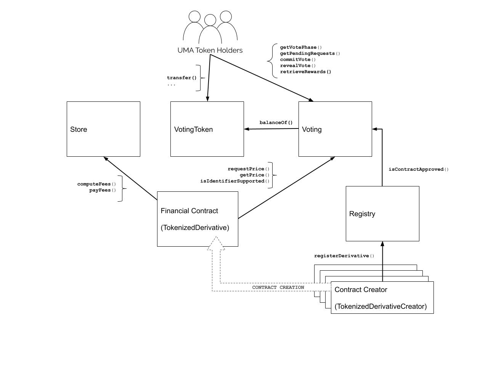

# UMA System Architecture

This document explains the general architecture of UMA's DVM (Oracle). It is meant to be a high level overview and is
by no means an exhaustive explanation of the system.

## Purpose

The purpose of the DVM is to provide prices for assets. The DVM provides these prices to financial contracts, which are
just smart contracts that need an asset price and have some amount of money that depends on that price.

## VotingToken

The VotingToken is a simple ERC20 contract that represents a voter's stake in the UMA DVM.

## Voting

The DVM is powered by voters. Each price request from a financial contract must be voted on. The relative weighting
of votes is determined by how many VoteTokens each participant holds.

After a request is received, a voting period begins. Voters follow a typical commit-reveal cycle to provide their votes
to the Voting contract.

After the vote period ends, the contract rewards the voters who voted with the majority by minting them new tokens
proportionally to their vote share. Voters who did not vote or voted incorrectly do not receive newly minted tokens.

## Financial Contracts

Financial contracts make price requests to the Voting contract when they need a price input. Once that price request
has been resolved, they call `getPrice()` to retrieve the price that was returned.

To pay for the DVM service, financial contracts must pay fees to the Store contract. The Store has methods that take
fees and methods that allow contracts to compute the required payment. There are two types of fees:

- Regular Fee: a periodic fee that's based on the amount of money the contract is holding.

- Final Fee: a fee that's paid on every price request.

Contracts are expected to honestly pay their fees. To enforce this, the Voting contract only accepts price requests
from approved contract types.

## Contract Creators

To deploy an approved contract type, one must deploy it through an approved contract creator. Contract creators are
small, shell contracts whose job is only to deploy financial contracts. If a contract creator is approved, it means
that it has been reviewed to ensure that all contracts that it can deploy will pay their fees honestly.

When a contract creator deploys a new financial contract, it registers it with the Registry contract to signal its
approval.

## Registry

The Voting contract uses the Registry to validate whether a financial contract should be allowed to make a price
request.

The Registry maintains two lists:

- Approved contract creators: these contracts have permission to register new financial contracts in the Registry.

- Approved financial contracts: these contracts have been registered by an approved contract creator and are allowed to
make price requests to the Voting contract.
