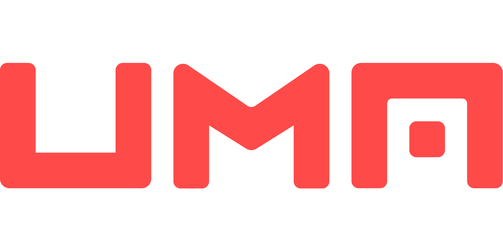

# UMA Protocol

<p align="center">
  
</p>

[](https://app.circleci.com/pipelines/github/UMAprotocol/protocol)
[](https://hub.docker.com/r/umaprotocol/protocol)
[](https://coveralls.io/github/UMAprotocol/protocol?branch=master)

[](https://github.com/UMAprotocol/protocol/blob/master/LICENSE)
[](https://github.com/UMAprotocol/protocol/commits/master)
[](https://github.com/UMAprotocol/protocol/commits/master)
[](https://github.com/UMAprotocol/protocol/graphs/contributors)

[](https://umaproject.org/)
[](https://discord.com/invite/jsb9XQJ)
[](mailto:hello@umaproject.org)
[](https://twitter.com/UMAprotocol)

## Documentation 📚

Our docs site is [here](https://docs.umaproject.org). It contains tutorials, explainers, and smart contract
documentation. If you'd like to view these docs on github instead, check out the
[documentation folder](./documentation).

## Security and Bug Bounty 🐛

Please see [here](./documentation/developer_reference/bug_bounty.md) for details on our bug bounty.

## Developer Information and Tools 👩‍💻

For information on how to initialize and interact with our smart contracts, please see the
[documentation site](https://docs.umaproject.org).

### Install dependencies 👷‍♂️

You'll need the latest LTS release of nodejs and npm installed. Assuming that's done, run:

```
npm install
```

### Running the linter 🧽

To run the formatter, run:

```
npm run lint-fix
```

## Coverage 🔎

We use the [solidity-coverage](https://github.com/sc-forks/solidity-coverage) package to generate our coverage reports.
You can find the coverage report at [coveralls](https://coveralls.io/github/UMAprotocol/protocol). Otherwise, you can generate it locally by running:

```
./ci/coverage.sh core
```

The full report can be viewed by opening the `core/coverage/index.html` file in a browser.

## Style Guide 🕺

See [STYLE.md](STYLE.md).

## Roadmap for the DVM 🛣

Version 1 of the UMA Token and DVM have been released and launched. You can find the addresses of relevant contracts
[here](./core/networks/1.json). This version implements most of what's described in the
[whitepaper](https://github.com/UMAprotocol/whitepaper/blob/master/UMA-DVM-oracle-whitepaper.pdf). Notable exceptions
include:

- The voting process uses a simple modal majority. If there is no majority, the vote is retried in the next round.
- Defense against parasitic usage as described in section 8.1.
- The buyback-and-burn mechanism is currently run by the UMA Foundation rather than other automated mechanisms
  mentioned in section 5.2.

The goal is to bring the implementation closer to the whitepaper in future DVM upgrades. Please see the
[documentation site](https://docs.umaproject.org) for more details.
