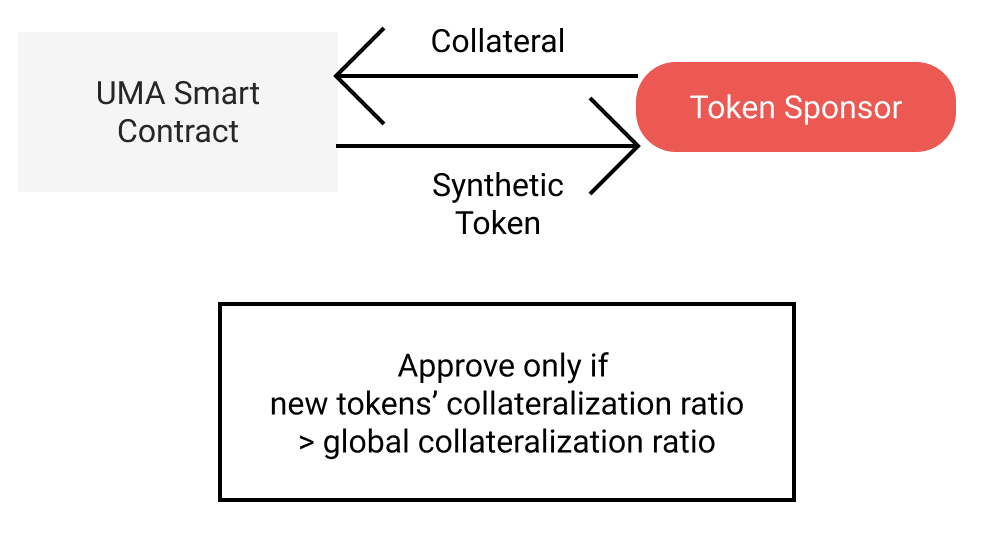
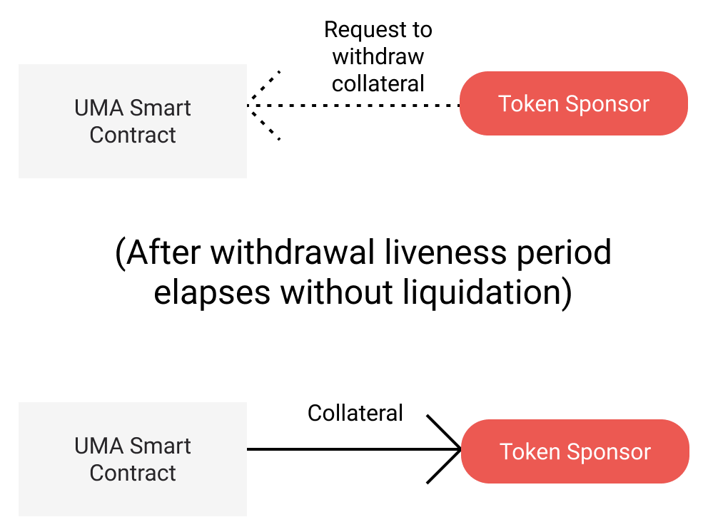
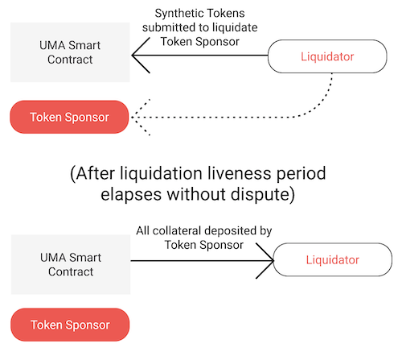
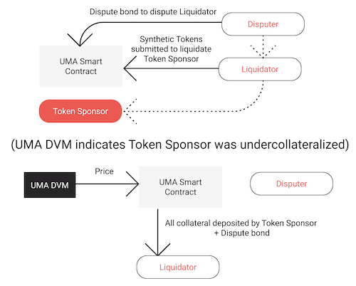
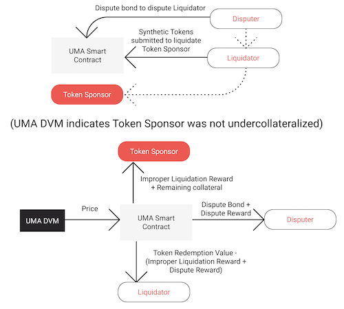
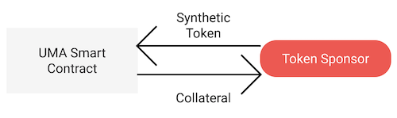
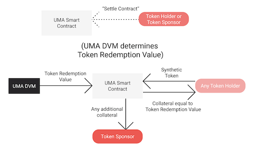

# Overview

Synthetic tokens are collateral-backed tokens whose value fluctuates depending on the tokens’ reference index. Synthetic tokens blend features of prediction markets, futures markets, and collateralized loans.

Some examples of synthetic tokens include:

- synthetic real-world assets (eg: gold or Tesla stock price)
- synthetic cross-chain cryptoassets
- tracking tokens for various non-tradable indices

Some of the most creative ideas for synthetic tokens fall in the last category. Check out our [Slack channel #tokenideas](https://join.slack.com/t/umaprotocol/shared_invite/enQtNTk4MjQ4ODY0MDA1LTM4ODg0NGZhYWZkNjkzMDE4MjU0ZGFlYWQzZTFiZWFlZjI2NDE4OGI2NWY3OTdhYjYyZjg0MjAzMTgwODVhZTE) for more project ideas like:

- tokens that track the future usage of DeFi projects (e.g. assets locked in Uniswap)
- tokens that track the number of downloads of a Chrome extension (e.g. Metamask)
- tokens that track the success of trade ideas on r/WallStreetBets

## Priceless Synthetic Tokens

“Priceless” synthetic tokens are synthetic tokens that are securely collateralized without an on-chain price feed. These tokens are designed with mechanisms to incentivize token sponsors (those who create synthetic tokens) to properly collateralize their positions. These mechanisms include a liquidation and dispute process that allows token holders to be rewarded for identifying improperly collateralized [token sponsor](glossary.md#token-sponsor) positions. The dispute process relies on an oracle, the UMA [DVM](glossary.md#dvm), to settle disputes regarding liquidations.

To ensure that the rewards for liquidations and disputes are economical (i.e. worth the gas/transaction cost to liquidate or dispute), deployers of this financial contract template can set a minimum sponsor size.
This is the minimum number of tokens that a token sponsor must have created against the contract.
Any action that would reduce a token sponsor's position to below this threshold is disallowed and will revert.
This includes partial liquidations that leave the sponsor's position smaller than the minimum size, token redemptions that bring the position below the minimum size, and new position creations that request to mint fewer than the minimum number of tokens.

For more details on how a “priceless” framework can be applied more generally to other types of financial contract templates on the blockchain, check out this blog post. <!-- TODO: add link to blog post -->

## Launching a New Synthetic Token

To launch a new type of synthetic token for which an existing market does not yet exist, that synthetic token’s smart contract must first be parameterized and deployed. Anyone can parameterize and deploy this contract.

This smart contract can be deployed using UMA’s synthetic token contract template and defining key parameters. Some parameters to highlight are:

- token’s [price identifier](glossary.md#price-identifier) (the price feed this token should track)
- token expiration timestamp
- token [collateralization requirement](glossary.md#collateralization-requirement) (e.g. a synthetic token must have collateral worth at least 120% of the price indentifier’s current value)

This [tutorial](tutorials/creating_from_truffle.md) will show you how to parameterize and deploy the smart contract for a new synthetic token from the command line.

## Creating Synthetic Tokens From an Existing Contract

After the contract is deployed, anyone can interact with the contract to create synthetic tokens. These actors are called “[token sponsors](glossary.md#token-sponsor)”, since they sponsor the creation of synthetic tokens.

Token sponsors deposit collateral into the contract to collateralize synthetic tokens, which they can then withdraw and trade with others. The first token sponsor to create synthetic tokens is able to immediately withdraw synthetic tokens from the contract. Any following token sponsors who wish to create synthetic tokens can do so, but must collateralize their positions by at least as much as the system’s [global collateralization ratio](glossary.md#global-collateralization-ratio-gcr). This ensures that all newly created tokens sponsor positions are correctly collateralized upon initialization.

The global collateralization ratio (GCR) is the average collateralization ratio among all token sponsor positions that have not yet been liquidated nor have any outstanding withdrawal requests. Requiring new token sponsors to collateralize their positions by as much as the GCR provides some assurances that so long as those token sponsors collateralized below the GCR have not yet been liquidated, those above the GCR need not be at risk of liquidation.

This [tutorial](tutorials/creating_from_truffle.md#create-new-tokens-from-an-existing-contract) will show you how to mint tokens from the command line after having parameterized and deployed the synthetic token’s smart contract.

## Managing Token Sponsor Positions

During the lifetime of the synthetic token, token sponsors may want to deposit additional collateral to their positions so as to avoid liquidation. Sponsors may also want to withdraw excess collateral if the position has moved in their favor.

Token sponsors can deposit additional collateral at any time.

Token sponsors can withdraw excess collateral in one of two ways: a “fast” withdrawal or “slow” withdrawal.

### “Fast” withdrawal:

A “fast” withdrawal allows a token sponsor to withdraw excess collateral from his position immediately, so long as the resulting position is collateralized by at least as much as the [global collateralization ratio](glossary.md#global-collateralization-ratio-gcr) (GCR). Requiring withdrawals to result in collateralization at least as high as the GCR provides some assurances that so long as the other token sponsors collateralized below the GCR have not yet been liquidated, this token sponsor should not be liquidated after making this withdrawal.

### “Slow” withdrawal:

If the token sponsor wishes to withdraw collateral from his position that would bring his collateralization below the global collateralization ratio, he can do so via a “slow” withdrawal. Because withdrawing this amount of collateral could potentially jeopardize the solvency of the fungible synthetic tokens, this “slow”, 2-part, withdrawal process allows other token holders to flag if a withdrawal would render the token sponsor insolvent.

In a “slow” withdrawal, there are two parts:
The token sponsor submits a withdrawal request to the contract indicating the amount of collateral he wishes to withdraw and the timestamp of the request.

During this period, any token holder can liquidate the token sponsor’s position if they believe a withdrawal of the amount indicated in the withdrawal request would bring the token sponsor’s collateralization below the “[collateralization requirement](glossary.md#collateralization-requirement)” at the time of liquidation.
If the “[withdrawal liveness period](glossary.md#withdrawal-liveness-period)” passes without a token holder liquidating the token sponsor, the token sponsor may withdraw collateral from his position up to the amount requested.

## Liquidation and Dispute

At any time, a token holder may liquidate a token sponsor’s position. Liquidations happen immediately without calling the oracle. Anyone may dispute a liquidation within the “[liquidation liveness period](glossary.md#liquidation-liveness-period)”.

To liquidate a token sponsor position, a token holder submits tokens to the contract and posts a liquidation bond.
The liquidation bond covers the cost of calling the DVM if the liquidation is disputed.
If the liquidation is not disputed, the liquidation bond is returned to the liquidator.
The tokens are submitted for 3 purposes: to indicate the size of the position to be liquidated, to close the token sponsor’s position, and to attest to the liquidator’s belief that the token sponsor’s position should be liquidated.
The liquidator will lose a portion of the collateral corresponding to the tokens if their liquidation is disputed and found to be invalid.

Here are three ways in which a liquidation can be resolved:

1. No one disputes the liquidation during the liquidation liveness period. After the liquidation liveness period ends, collateral deposited by the token sponsor is returned to the liquidator, proportional to the number of synthetic tokens the liquidator has submitted in liquidation. As a numerical example, assume a token sponsor has deposited 150 DAI of collateral to create 100 synthetic tokens, which they then sold to the market. Later, a liquidator submits 30 synthetic tokens to liquidate the token sponsor. If no one disputes the liquidation, the liquidator will receive 30% of the token sponsor’s collateral, or 45 DAI.

2. Someone disputes the liquidation during the liquidation liveness period. To do this, the disputer must post a bond. Once the dispute is raised, a price request is made to the UMA [DVM](glossary.md#dvm). This price request will return the value of the price identifier at the time of the liquidation, which will determine if the token sponsor was undercollateralized and resolve the "dispute".

- If the price returned by the DVM indicates that the token sponsor was undercollateralized at the time of the liquidation:
  - The disputer will lose their bond.
  - The liquidator will receive all of the token sponsor position’s collateral.
  - The token sponsor will not receive any of the collateral they have previously deposited into the position.
    
- If the price returned by the [DVM](glossary.md#dvm) indicates that the token sponsor was not undercollateralized at the time of the liquidation:
  - The disputer will receive back their dispute bond and a dispute reward.
  - The liquidator will receive collateral equalling: (i) the value of the token at the time of liquidation as determined by the DVM, less (ii) the dispute reward paid to the disputer, less (iii) the improper liquidation reward paid to the original token sponsor.
  - The token sponsor will receive any remaining collateral and a reward for the improper liquidation.
    

## Redeeming Tokens

Before the expiration date of the token, tokens may only be redeemed by token sponsors. A token sponsor redeems a token by submitting it to the contract to be burned and receiving collateral proportional to the total amount of collateral that the token sponsor has deposited to the contract.

Consider the following example. Assume a token sponsor has deposited 150 DAI of collateral to create 100 synthetic tokens, which they then sold to the market. Later, the token sponsor repurchases 30 tokens and decides to redeem them. These 30 tokens represent 30% of the token sponsors original position, so by redeeming them the token sponsor receives 30% of their initial collateral, or 45 DAI (since 30% \* 150 = 45).

### Redeeming After Expiry

After the expiration timestamp for the synthetic tokens, anyone may settle the contract. This calls on the UMA [DVM](glossary.md#dvm) to return the value of the token’s price identifier at the expiration timestamp.

After this value is returned to the contract and the contract is settled, any token holder can redeem the tokens against the contract. Redemption of the tokens returns the token holder collateral equal to the [price identifier](glossary.md#price-identifier) value returned by the UMA DVM.

