# UMA Sponsor CLI Tool

The Sponsor CLI tool lets you interact with a synthetic token contract.
In this tutorial, you’ll be deploying a synthetic token contract to a local testnet and interacting with it via the Sponsor CLI tool.

It will let you be the “Token Sponsor,” which lets you:

- Deposit collateral (ETH) and borrow synthetic tokens
- Manage your position’s collateral (deposit/withdraw)
- Redeem the borrowed synthetic tokens and get collateral back
- Transfer your position to another Ethereum address

This [video](https://www.crowdcast.io/e/defi-discussions/18) will walk through the steps of this tutorial, starting around minute 11:00.

## Prerequisites

1. Install homebrew via website `brew.sh`
2. Install [Node v12](https://nodejs.org/en/download/) and make sure that npm is v6 or above. You can verify by running in the terminal:

```bash
node -v
npm -v
```

3. If on local testnet:

- Install [Ganache](https://www.trufflesuite.com/ganache)
- Run ganache
- Click “new workspace”
- In the server tab, change “Port Number” to `9545`
- In the “Accounts & Keys” tab, change “Account Default Balance” to `100000000`
- (Optional) In the Server tab, deselect "Automine". Turning off "Automine" provides a more “authentic” blockchain experience but can be very frustrating.

Once you have set up your environment, clone the repo and install the CLI tool.

4. Download the code by typing this into terminal:

```bash
git clone https://github.com/UMAprotocol/protocol.git
```

5. Run `npm install` in `protocol/`.

## Launching the CLI tool

1. Navigate to the `/core` folder: `cd core`
2. If on Kovan testnet, apply network addresses:

```bash
$(npm bin)/apply-registry
```

3. Compile and migrate the contracts:

```bash
$(npm bin)/truffle compile
$(npm bin)/truffle migrate --reset --network=test
```

4. Deploy a contract to create priceless synthetic tokens named “BTCUSD”.
   Each synthetic token is an ERC-20 token that represents a synthetic bitcoin, collateralized by ETH.

```bash
$(npm bin)/truffle exec scripts/local/DeployEMP.js --network=test
```

This is the output you should see:

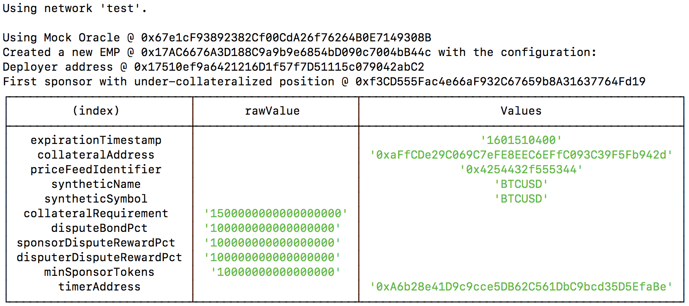

5. Run the CLI.

```bash
sh scripts/cli/cli_entry.sh --network=test
```

This will show you the top-level menu of the CLI tool.

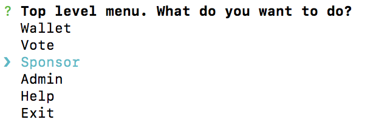

## Navigate to Live Synthetic Tokens

Now that you can see the priceless synthetic token contract we will be interacting with, the CLI tool can be used to create additional synthetic tokens from this same contract.

From the top-level menu in the CLI tool, use the arrow keys to select “Sponsor” and press “Enter”.

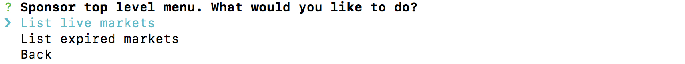

View the live contracts to see a list of synthetic tokens on the network that are live (i.e. not yet expired).
Because there is only one deployed contract on this local testnet, only one is shown. Select this one by pressing “Enter”.

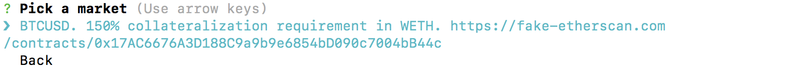

## Creating New Synthetic Tokens

Navigate to the list of live synthetic tokens. Because you are not yet a token sponsor for this synthetic token, you are prompted to “Sponsor new position”. Use the arrows to navigate to this option and press “Enter”. Enter the number of tokens you would like to create (10 in this example).

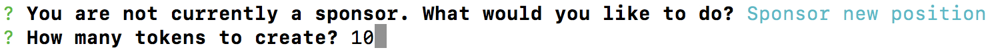

After displaying the required amount of ETH to create this position, you are prompted to confirm if you would like to proceed.

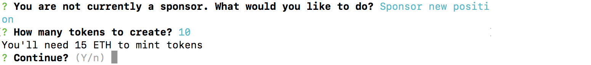

A summary of the relevant transactions is displayed, as well as an updated summary of your token sponsor position.

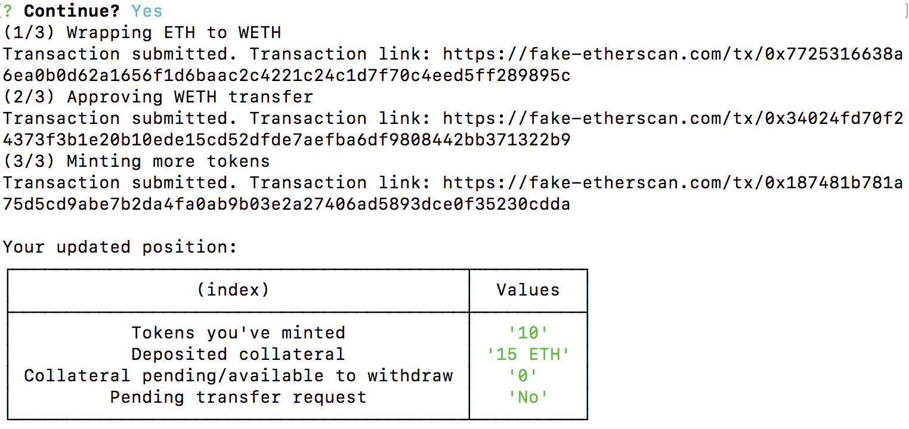

## Depositing Additional Collateral

Navigate to the list of live synthetic tokens. Select the token contract for which you are a token sponsor. Here are the options available to help manage your token sponsor position:

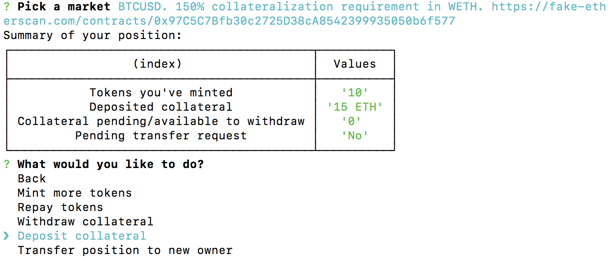

Navigate to “Deposit collateral” and press “Enter”.
Input the number of ETH you would like to deposit.
In this example, you will deposit 20 additional ETH.

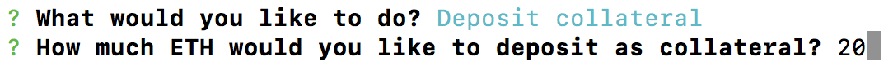

After confirming the transaction, you will be presented with a summary of the transactions and an updated summary of your position. Note that the amount of deposited collateral has increased from 15 ETH to 35 ETH.

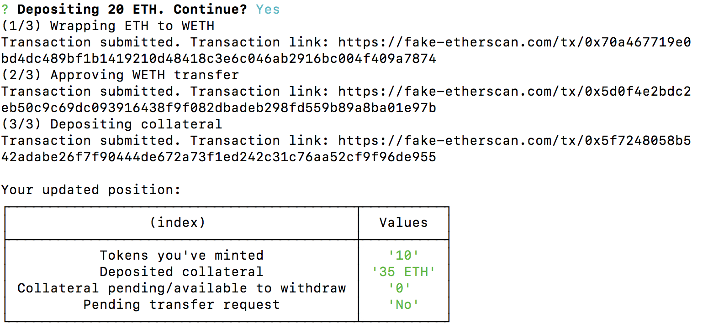

## Withdrawing excess collateral

Navigate to the list of live synthetic tokens. Select the token contract for which you are a token sponsor. Navigate to “Withdraw collateral” and press “Enter”.

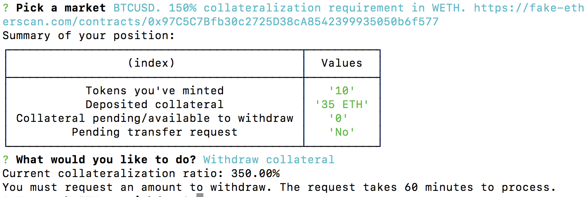

Because you are the only token sponsor, you cannot make a “fast” withdrawal as explained [here](../synthetic_tokens/explainer.md).
Rather, this will be a “slow” delay. The request will take 60 minutes to process, as the liveness period for withdrawals has been set in this local testnet deployment to 60 minutes.
Request to withdraw 15 ETH. After submitting this request, a summary of the relevant transaction will be displayed, as well as an updated summary of your token sponsor position.
Note that the pending collateral withdrawal of 15 ETH is now reflected.

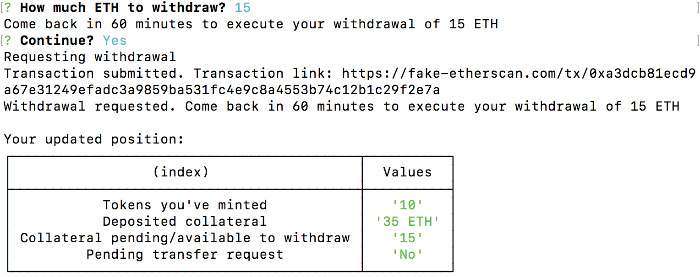

Because time does not advance automatically on your local blockchain with Ganache, you should exit the Sponsor CLI tool and advance time manually with the following command.

```bash
$(npm bin)/truffle exec scripts/local/AdvanceEMP.js --network=test
```

Return to the Sponsor CLI tool with the following command.

```bash
sh scripts/cli/cli_entry.sh --network=test
```

Navigate to the contract you previously used to create a synthetic token position.

Note that you have a pending withdrawal. Navigate to “Manage your withdrawal request” and press “Enter”.
Note that the withdrawal request is now ready to be executed.


Navigate to “Execute Pending Withdrawal” and press “Enter”. After confirming, you are presented with a summary of the relevant transactions and your updated position summary.
Note that 15 ETH has been withdrawn from the position, updating the deposited collateral to 20 ETH.

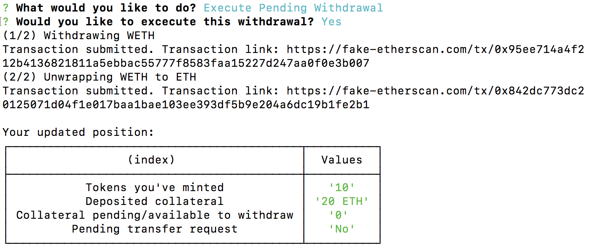

## Redeeming Synthetic Tokens

Navigate to the list of live synthetic tokens and select the contract for which you are a token sponsor. Navigate to “Repay tokens” and press “Enter”.


You will now indicate how many tokens you would like to redeem. Each token is redeemable for 2 ETH, since that reflects the pro rata collateralization of each token by the token sponsor.
Only token sponsors are allowed to redeem tokens prior to their expiration. Request to redeem 5 tokens.
After confirming, you will be presented with the relevant transactions and a summary of the updated token sponsor position. Note that there are now 5 tokens outstanding.

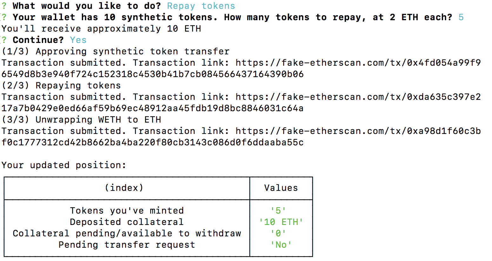

## Transferring a Token Sponsor Position

Navigate to the list of live synthetic tokens and select the contract for which you are a token sponsor. Navigate to “Transfer position to new owner” and press “Enter”.
After confirming, your request to transfer the token sponsor position will be submitted. Just as with a withdrawal request, this request will have a liveness period of 60 minutes.[^1]

[^1]: If transfers were instantaneous, a sponsor who is about to get liquidated would simply transfer their position to a different account, thereby avoiding (frontrunning) the liquidation. In theory, they could keep doing these transfers forever, never getting liquidated.

Note that your summary indicates that there is a “Pending transfer request”.

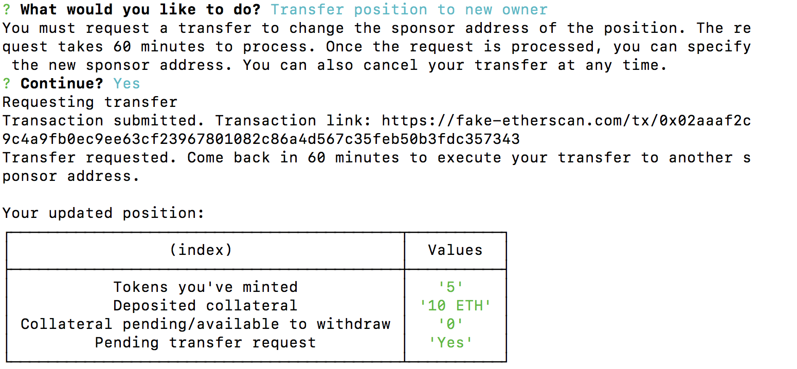

Because time does not advance automatically on your local blockchain with Ganache, you should exit the Sponsor CLI tool and advance time manually with the following command:

```bash
$(npm bin)/truffle exec scripts/local/AdvanceEMP.js --network=test
```

Return to the Sponsor CLI tool with the following command:

```bash
sh scripts/cli/cli_entry.sh --network=test
```

Navigate to the contract you are a token sponsor for.


Navigate to “Transfer position to new owner” and press “Enter”.
The Sponsor CLI tool indicates that the liveness period has elapsed and the request is ready to be executed.
Navigate to “Execute Pending Transfer” and press “Enter”. You will be prompted to enter the address to transfer the position to. In this demo, the position will be transferred to `0x04Fa0d235C4abf4BcF4787aF4CF447DE572eF828`.
After confirming, you will be notified that you are no longer a token sponsor.

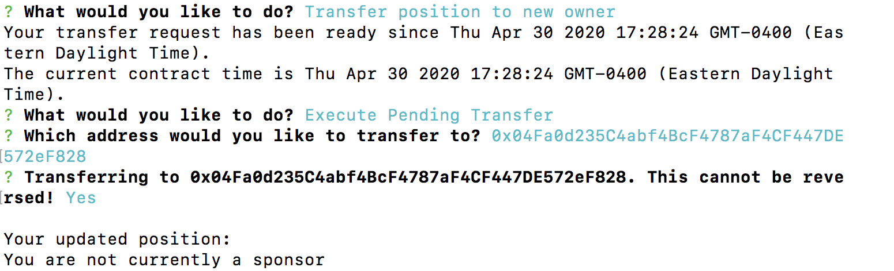
