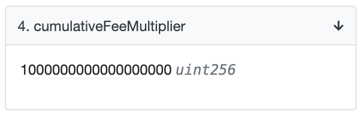
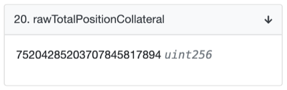
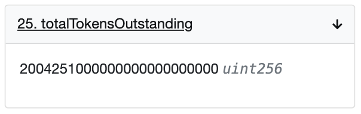
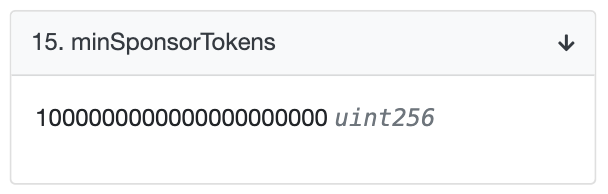
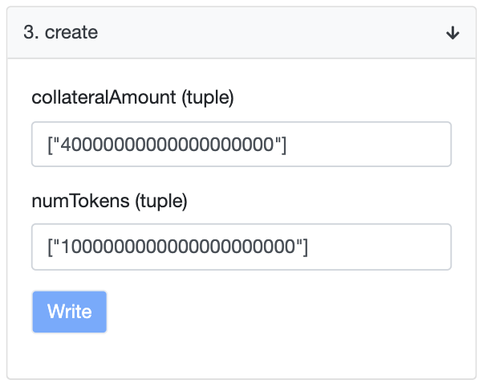
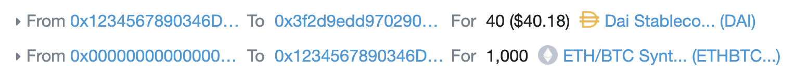
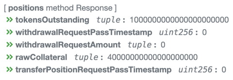

# Minting Synthetic Tokens via Etherscan

This article will walk you through minting tokens (like ETHBTC or yCOMP) for the first time on Etherscan’s contract interaction GUI. If you already have a position (i.e. if you’ve already minted tokens, these steps may not apply to you). The screenshots and example numbers used in this tutorial reflect the ETHBTC token, but all steps in this article apply just the same to any other expiring multi-party token (like the yCOMP).

You can already mint tokens via the [CLI tool](./using_the_uma_sponsor_cli_tool.md), but you may prefer to interact with the contract more directly via Etherscan. All you’ll need to get started is some DAI to use as collateral (50 DAI should be enough) and ETH to pay for transaction gas (0.05 ETH should be enough).

## Before we begin: collateral approval

The token minting contract needs approval to transfer the collateral currency (DAI in this case) on your behalf. To do that, follow these instructions:

1. Go to the [Write Contract Tab](https://etherscan.io/address/0x6b175474e89094c44da98b954eedeac495271d0f#writeContract) on the [DAI](https://etherscan.io/token/0x6b175474e89094c44da98b954eedeac495271d0f) contract page.
2. Search for the `approve` function.
3. For the first argument, pass in the address of the token minting contract (for ETHBTC it is `0x3f2d9edd9702909cf1f8c4237b7c4c5931f9c944`, for yCOMP it is `0x67DD35EaD67FcD184C8Ff6D0251DF4241F309ce1`).
4. For the second argument, pass in the maximum amount of collateral you intend to supply or alternatively any sufficiently high number.
   - This will be in units of Wei; use this [converter](http://eth-converter.com/).
   - For example, 100 DAI would be a value of `100000000000000000000`.
5. Hit write, and confirm the transaction through your wallet. Once the transaction is mined, your allowance is now set.
6. You can confirm this by going to the [Read Contract Tab](https://etherscan.io/address/0x6b175474e89094c44da98b954eedeac495271d0f#readContract) and looking for the `allowance` function.
7. Pass in your own address as the first argument and the token minting contract address (from Step 3 above) as the second argument.
8. Hit Query and confirm that you get the resulting DAI allowance you just set.

## Three considerations for minting tokens

There are three things we need to be concerned about when minting tokens for the first time (note that this is a little different if you have an existing position):

1. Meeting the Global Collateralization Ratio (GCR);
2. Minting the minimum required number of tokens, and;
3. Supplying the minimum required amount of collateral.

Once we have determined the values for these three items, then we will be ready to mint some tokens!

### Computing for the GCR

This process can seem a little intimidating, but rest assured that it gets a lot easier after this step.

**The GCR is defined as the ratio of total collateral to the total number of tokens outstanding (i.e. GCR = total collateral / total tokens)** and we can only mint tokens if we collateralize enough to keep the GCR at its current level or higher.

To compute that, we need the true total collateral amount, and this we get from multiplying the “raw collateral” amount with a “cumulative fee multiplier”. This multiplier allows us to account for any fees that belong to the Oracle’s `Store` contract.

These instructions will compute for the GCR:

1. Go to the Read Contract Tab on the token minting contract page (for ETHBTC click [here](https://etherscan.io/address/0x3f2d9edd9702909cf1f8c4237b7c4c5931f9c944#readContract), for yCOMP click [here](https://etherscan.io/address/0x67DD35EaD67FcD184C8Ff6D0251DF4241F309ce1#readContract)).
2. Search for the `cumulativeFeeMultiplier` function and observe the number there. This is in units of Wei so you will again need to convert it back into a human-readable number with the converter above. For example, a value of `1000000000000000000` would equate to **a multiplier with the value of `1`**.

   

3. Next search for the `rawTotalPositionCollateral` function and observe the number there. Multiply this number with the multiplier above to get the true total collateral amount. In this example, the resulting **total collateral amount is `75204285203707845817894`, or ~`75,204` when converted from Wei**.

   

4. Next, search for the `totalTokensOutstanding` function and observe the number there. In this example the **total number of tokens outstanding is `2004251000000000000000000` or ~`2,004,251` when converted from Wei**.

   

5. The GCR is simply a ratio of these two numbers (i.e. total collateral / total tokens outstanding), so in our example: **GCR = 75,204 / 2,004,251 = ~0.038**

### Minimum number of tokens to mint

There is a setting in the contract that defines the minimum number of tokens your position must have. For ETHBTC this value is set at 1000 tokens and for yCOMP it is 1 token, but if you wanted to confirm this on Etherscan, you can follow these instructions:

1. Go to the Read Contract Tab on the token minting contract page (for ETHBTC click [here](https://etherscan.io/address/0x3f2d9edd9702909cf1f8c4237b7c4c5931f9c944#readContract), for yCOMP click [here](https://etherscan.io/address/0x67DD35EaD67FcD184C8Ff6D0251DF4241F309ce1#readContract)).
2. Search for the `minSponsorTokens` function and observe the number there. In this example, a value of `1000000000000000000000` or **`1000` tokens when converted from Wei**.

   

This means that by the end of your minting transaction, you would need to make sure that you would have minted a total of 1000 tokens outstanding.

### Minimum amount of collateral required

Since the `GCR = total collateral / total tokens`, in order to maintain the GCR while minting the minimum amount of tokens, we simply multiply the number of tokens we want to mint with the GCR to find the required amount of collateral.

Assuming we want to mint 1000 tokens, that would mean we need **`1000 * GCR (~0.038) = ~38 DAI` of collateral**.

## Minting the actual tokens

Finally, we are ready to mint the actual synthetic tokens. You might want to add a bit more collateral than the minimum to prevent yourself from being liquidated (the minimum collateralization ratio is 120% for ETHBTC and 150% for yCOMP). In this example, we will put in 40 DAI.

1. Go to the Write Contract Tab on the token minting contract page (for ETHBTC click [here](https://etherscan.io/address/0x3f2d9edd9702909cf1f8c4237b7c4c5931f9c944#writeContract), for yCOMP click [here](https://etherscan.io/address/0x67DD35EaD67FcD184C8Ff6D0251DF4241F309ce1#writeContract)).
2. Search for the `create` function.
3. For the first argument, input the collateral amount in Wei wrapped in double-quotes and square brackets. For example, 40 DAI of collateral would mean inputting `[“40000000000000000000”]`.
4. For the second argument, input the number of tokens (in Wei) that you want to mint, and wrap it in double-quotes with square brackets just like above.

5. Hit write, and confirm the transaction through your wallet. Once the transaction completes, you should have minted your tokens. The Etherscan page for that transaction should look something like this:

### Checking your position

Now that we have minted our tokens, let’s check the smart contract to make sure it’s keeping tracking of our tokens and collateral properly.

1. Go to the Read Contract Tab on the token minting contract page (for ETHBTC click [here](https://etherscan.io/address/0x3f2d9edd9702909cf1f8c4237b7c4c5931f9c944#readContract), for yCOMP click [here](https://etherscan.io/address/0x67DD35EaD67FcD184C8Ff6D0251DF4241F309ce1#readContract)).
2. Search for the `positions` function.
3. Paste in your address into the textbox and hit Query.
4. You should see something like the following:

From this, we can conclude that we have successfully minted 1000 tokens with 40 DAI of supplied collateral.

## What next?

Now that you have minted your tokens, you need to make sure that it stays collateralized as the value of the underlying moves (e.g. the ETH to BTC ratio, or the price of COMP in USD). You can do this with the Sponsor [CLI tool](./using_the_uma_sponsor_cli_tool.md) that helps you manage your position. In the future, we might provide a dapp frontend for your convenience. Let us know on our Discord if you want to see this.

In order to get short exposure, don't forget to sell these tokens rather than hold onto them (the idea is that you can buy them cheaper on the market later on to unwind your position). For example, on Uniswap you can trade ETHBTC tokens [here](https://uniswap.exchange/swap?inputCurrency=0x6b175474e89094c44da98b954eedeac495271d0f&outputCurrency=0x6d002a834480367fb1a1dc5f47e82fde39ec2c42) and yCOMP tokens [here](https://uniswap.exchange/swap?inputCurrency=0xc00e94cb662c3520282e6f5717214004a7f26888&outputCurrency=0xc78Ce805599188eD734C943C912800658807fA14). The tokens in the example above will expire on August 1st, 2020 (and become redeemable by anyone), so make sure to keep that in mind as well.
